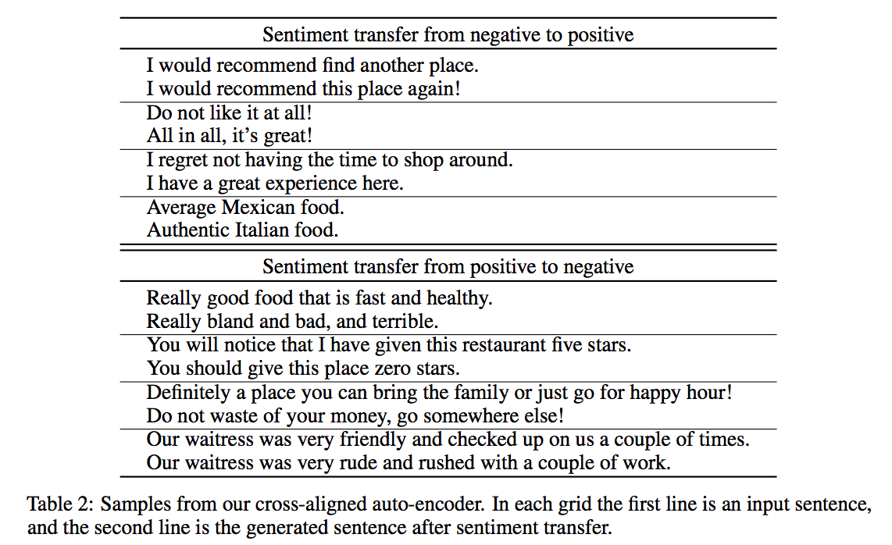

# Language Style Transfer
This repo contains the code and data of the following paper:

<i> "Style Transfer from Non-Parallel Text by Cross-Alignment". Tianxiao Shen, Tao Lei, Regina Barzilay, and Tommi Jaakkola. NIPS 2017. [arXiv](https://arxiv.org/abs/1705.09655)</i>

The method learns to perform style transfer between two non-parallel corpora. For example, given positive and negative reviews as two corpora, the model can learn to reverse the sentiment of a sentence.
<p align="center"></p>

<br>

## Spotlight Video
[](https://www.youtube.com/watch?v=OyjXG44j-gs)

<br>

## Data Format
Please name the corpora of two styles by "x.0" and "x.1" respectively, and use "x" to refer to them in options. Each file should consist of one sentence per line with tokens separated by a space.

The <code>data/yelp/</code> directory contains an example Yelp review dataset.

<br>

## Quick Start
To train a model, first create a <code>tmp/</code> folder, then go to the <code>code/</code> folder and run the following command:
```bash
python style_transfer.py --train ../data/yelp/sentiment.train --dev ../data/yelp/sentiment.dev --output ../tmp/sentiment.dev --vocab ../tmp/yelp.vocab --model ../tmp/model
```

To test the model, run the following command:
```bash
python style_transfer.py --test ../data/yelp/sentiment.test --output ../tmp/sentiment.test --vocab ../tmp/yelp.vocab --model ../tmp/model --load_model true
```

The model and results will be saved in the <code>tmp/</code> folder.

Check <code>code/options.py</code> for all running options.

<br>

## Dependencies
Python >= 2.7, TensorFlow 1.3.0
